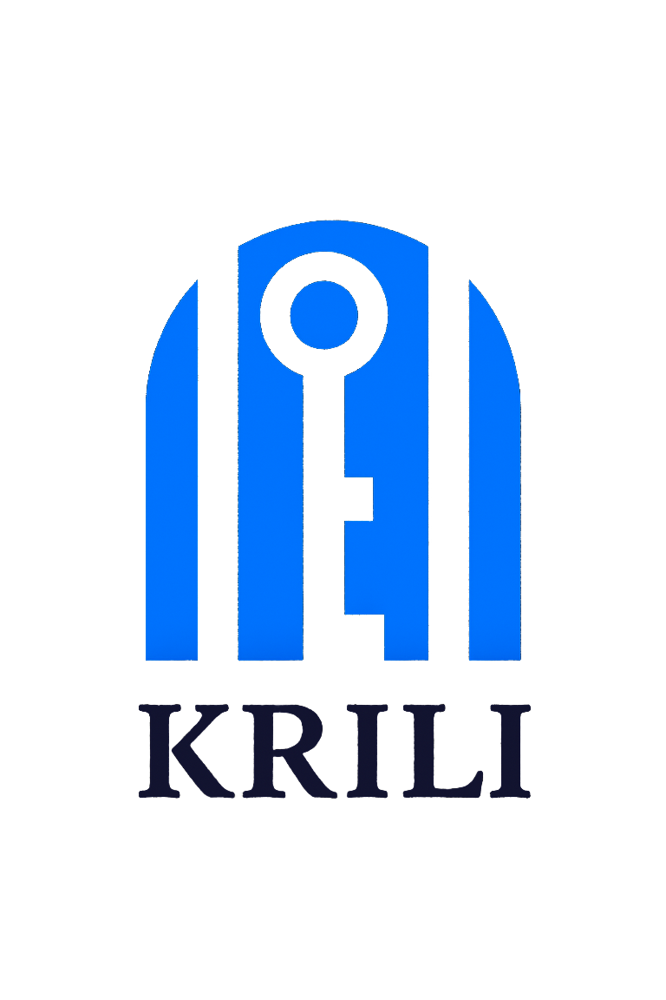

<div align="center">
  
# 🚀 Krili - Peer-to-Peer Rental Marketplace



### 🌟 *Connect • Rent • Share* 🌟

<p>
  
</p>

</div>

<div align="center">

[](https://nextjs.org/)
[](https://www.typescriptlang.org/)
[](https://tailwindcss.com/)
[](https://ui.shadcn.com/)


</div>

---

<div align="center">

## 📖 About Krili


</div>

**Krili** is a modern, peer-to-peer rental marketplace that connects people who want to rent items with those who have items to rent. Whether you're looking to rent tools, electronics, vehicles, sports equipment, or anything else, Krili makes it easy to find and rent from your local community.

<div align="center">

## ✨ Features & Capabilities


</div>

<table>
<tr>
<td width="50%">

### 🤝 **Community Features**
- 🔗 **Peer-to-Peer Rentals**: Connect directly with local renters and owners
- 👥 **User Profiles & Reviews**: Build trust with verified profiles and user reviews
- 💬 **Real-time Messaging**: Communicate securely with potential renters
- ❤️ **Wishlist & Favorites**: Save items for later

</td>
<td width="50%">

### 🛠️ **Technical Features**
- 📱 **Responsive Design**: Optimized for all devices
- 🌍 **Multi-language Support**: Internationalization ready
- 🌙 **Dark/Light Mode**: Theme toggle for better user experience
- 🔍 **SEO Optimized**: Built-in SEO features for better discoverability

</td>
</tr>
<tr>
<td width="50%">

### 🎯 **Search & Discovery**
- 🔍 **Advanced Search & Filters**: Find exactly what you need with powerful search capabilities
- 📂 **Wide Range of Categories**: Tools, electronics, cameras, vehicles, sports equipment, and more

</td>
<td width="50%">

### 🎨 **User Experience**
- ⚡ **Fast Performance**: Built with Next.js 14 for optimal speed
- 🎭 **Beautiful UI**: Modern design with shadcn/ui components
- 📊 **Analytics Dashboard**: Track your rental activity
- 🤖 **AI Recommendations**: Python-powered ML system for personalized suggestions

</td>
</tr>
<tr>
<td width="50%">

### 🗄️ **Backend & Data**
- 🗃️ **SQL Database**: Robust relational data storage
- 🐍 **Python ML Engine**: Advanced recommendation algorithms
- 📈 **Data Analytics**: User behavior and rental pattern analysis
- 🔄 **Real-time Sync**: Live data updates across platform

</td>
<td width="50%">

### 🤖 **Automation & Support**
- 🔧 **n8n Workflows**: Automated customer support processes
- 💬 **Smart Chatbots**: AI-powered customer assistance
- 📧 **Email Automation**: Automated notifications and reminders
- 🎯 **Lead Management**: Automated user onboarding workflows

</td>
</tr>
</table>

<div align="center">

## 🚀 Tech Stack


</div>

<div align="center">

| Frontend | Backend | Database & ML | Automation |
|:--------:|:-------:|:------------:|:----------:|
|  |  |  |  |
|  |  |  |  |
|  |  |  |  |

</div>

### 🛠️ **Core Technologies**

<table>
<tr>
<td width="50%">

**🎯 Frontend Framework**
- 🚀 **[Next.js 14](https://nextjs.org/)** - React framework with App Router
- 📘 **[TypeScript](https://www.typescriptlang.org/)** - Type-safe TypeScript superset
- ⚛️ **[React 18](https://reactjs.org/)** - UI library with latest features

**🎨 Styling & UI**
- 🎨 **[Tailwind CSS v4](https://tailwindcss.com/)** - Utility-first CSS framework
- 🧩 **[shadcn/ui](https://ui.shadcn.com/)** - Beautiful UI components
- 🎭 **[Radix UI](https://www.radix-ui.com/)** - Accessible component primitives

</td>
<td width="50%">

**🐍 Machine Learning & Data**
- 🐍 **[Python](https://python.org/)** - ML recommendation engine backend
- 🤖 **[Scikit-learn](https://scikit-learn.org/)** - Machine learning algorithms
- 🗄️ **[SQL Database](https://www.mysql.com/)** - Relational data storage
- 📊 **[Pandas](https://pandas.pydata.org/)** - Data manipulation and analysis

**🔧 Development & Automation**
- 📦 **[pnpm](https://pnpm.io/)** - Fast, disk space efficient package manager
- 🔍 **[ESLint](https://eslint.org/)** - Code linting and formatting
- 🤖 **[n8n](https://n8n.io/)** - Workflow automation for customer support
- ✅ **[Zod](https://zod.dev/)** - TypeScript-first schema validation

**📊 Additional Libraries**
- 📈 **[Recharts](https://recharts.org/)** - Composable charting library
- 🎨 **[Lucide React](https://lucide.dev/)** - Beautiful & consistent icons
- 🎯 **[React Hook Form](https://react-hook-form.com/)** - Performant forms
- ✨ **Custom Animations** - Scroll reveal and floating elements

</td>
</tr>
</table>

<div align="center">

## 📦 Installation Guide


</div>

### 🚀 **Quick Start**

<table>
<tr>
<td width="50%">

#### 1️⃣ **Clone Repository**
```bash
# 📥 Clone the project
git clone https://github.com/Laadnanimoustapha/krili-react-ts.git
cd krili-react-ts
```

#### 2️⃣ **Install Dependencies**
```bash
# 📦 Install packages with pnpm
pnpm install
```

</td>
<td width="50%">

#### 3️⃣ **Environment Setup**
```bash
# 🔧 Copy environment file
cp .env.example .env.local
```
> 💡 Fill in your environment variables (API keys, database URLs, etc.)

#### 4️⃣ **Start Development**
```bash
# 🚀 Run development server
pnpm dev
```

</td>
</tr>
</table>

<div align="center">

### 🎉 **You're Ready!**

Open your browser and navigate to **[http://localhost:3000](http://localhost:3000)**


</div>

<div align="center">

## 🛠️ Available Scripts


<table>
<tr>
<td width="50%">
</div>
### 🚀 **Development**
```bash
# 🔥 Start development server
pnpm dev
```

### 🏗️ **Build**
```bash
# 📦 Build for production
pnpm build
```

</td>
<td width="50%">

### 🌐 **Production**
```bash
# 🚀 Start production server
pnpm start
```

### 🔍 **Linting**
```bash
# ✨ Run ESLint
pnpm lint
```

</td>
</tr>
</table>


<div align="center">

### 🗂️ **Key Directories**

| Directory | Purpose | Description |
|-----------|---------|-------------|
| 📱 `app/` | **Next.js App Router** | Modern routing with layouts and pages |
| 🧩 `components/` | **React Components** | Reusable UI components and features |
| 🎣 `hooks/` | **Custom Hooks** | Reusable React logic |
| 📚 `lib/` | **Utilities** | Helper functions and configurations |
| 🖼️ `public/` | **Static Assets** | Images, icons, and static files |

</div>

<div align="center">

## 🎨 UI Components & Design


</div>

<table>
<tr>
<td width="50%">

### 🎭 **Design System**
- 🎨 **shadcn/ui components** - Built on Radix UI primitives
- 🏙️ **"New York" style** - Clean and modern design
- 🎯 **Neutral color palette** - Professional appearance
- ♿ **Accessible components** - WCAG compliant

</td>
<td width="50%">

### 🛠️ **Theming Features**
- 🌙 **CSS variables** - Dynamic theming support
- 📏 **Consistent spacing** - Unified design language
- 📝 **Typography system** - Readable and scalable fonts
- 🎨 **Custom animations** - Smooth user interactions

</td>
</tr>
</table>

<div align="center">

## 🌐 Internationalization


</div>

### 🗣️ **Multi-language Support**

- 🌍 **Language context provider** - Global language state management
- 📄 **Translation files** - Organized in `lib/translations.ts`
- 🔄 **Language selector** - Easy language switching component
- 🎯 **Dynamic content** - Real-time language updates

<div align="center">

## 🔧 Customization Guide


</div>

<table>
<tr>
<td width="50%">

### 🧩 **Adding Components**
```bash
# 🎨 Add shadcn/ui component
npx shadcn-ui@latest add [component-name]
```

### 🎨 **Styling Options**
- 📝 **Global styles** - Modify `app/globals.css`
- 🎯 **Component styling** - Use Tailwind CSS classes
- 🎨 **Theme variables** - CSS variables for theming

</td>
<td width="50%">

### ⚙️ **Configuration**
- 🔧 **Tailwind config** - Customize design tokens
- 📦 **Component variants** - Extend existing components
- 🎭 **Animation settings** - Custom scroll and hover effects

### 🎯 **Best Practices**
- 📱 **Mobile-first** - Responsive design approach
- ♿ **Accessibility** - ARIA labels and keyboard navigation
- ⚡ **Performance** - Optimized components and lazy loading

</td>
</tr>
</table>

<div align="center">

## 🤝 Contributing


### 🚀 **How to Contribute**

</div>

<table>
<tr>
<td width="50%">

#### 1️⃣ **Fork & Clone**
```bash
# 🍴 Fork the repository
# 📥 Clone your fork
git clone https://github.com/Laadnanimoustapha/krili-react-ts.git
```

#### 2️⃣ **Create Branch**
```bash
# 🌿 Create feature branch
git checkout -b feature/amazing-feature
```

</td>
<td width="50%">

#### 3️⃣ **Commit Changes**
```bash
# 💾 Commit your changes
git commit -m 'Add some amazing feature'
```

#### 4️⃣ **Submit PR**
```bash
# 🚀 Push and create Pull Request
git push origin feature/amazing-feature
```

</td>
</tr>
</table>

<div align="center">


## Project Architecture

The diagram below illustrates the overall structure and workflow of the project:


### How It Works

- **User** sends requests via the frontend.
- **Next.js (TypeScript)** handles both frontend and backend logic.
- **Database (Postgres/MySQL)** stores and retrieves rental data.
- **Payments System (Stripe/PayPal)** processes payments.
- **Python ML Microservice (FastAPI)** receives user behavior data and returns recommendations.
- **Notification System (SendGrid/Twilio)** sends confirmation emails/SMS based on user actions and recommendations.

This architecture ensures modularity, scalability, and easy integration with external services.
## 📝 License


**This project is private and proprietary.**

---


### 💖 **Built with Love**

**Next.js** • **TypeScript** • **Tailwind CSS** • **shadcn/ui**

**BY [LAADNANI MOUSTAPHA](https://github.com/Laadnanimoustapha)** 🚀


</div>
